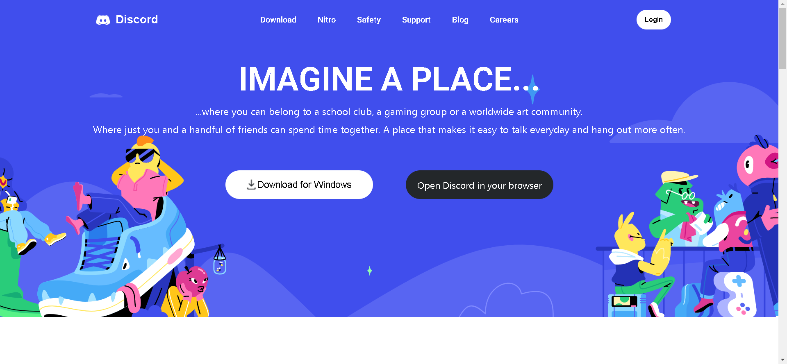
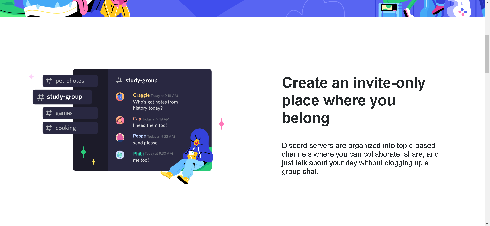
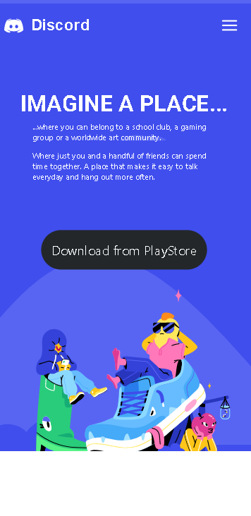
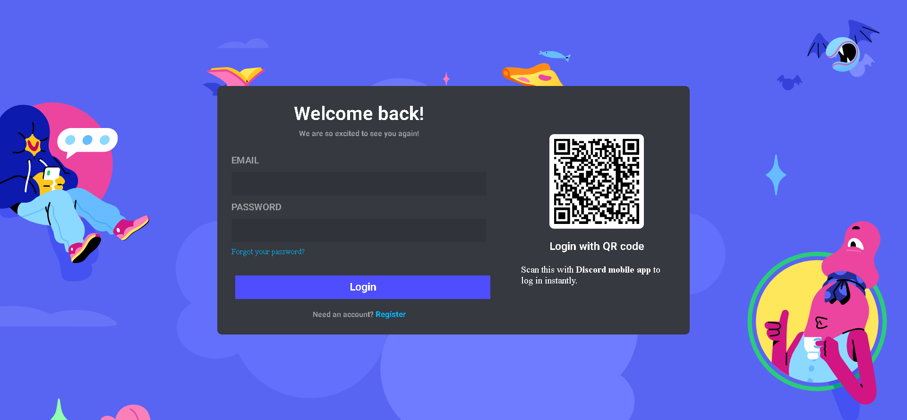
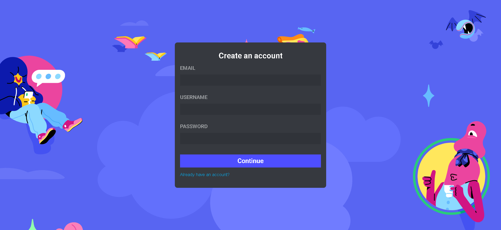
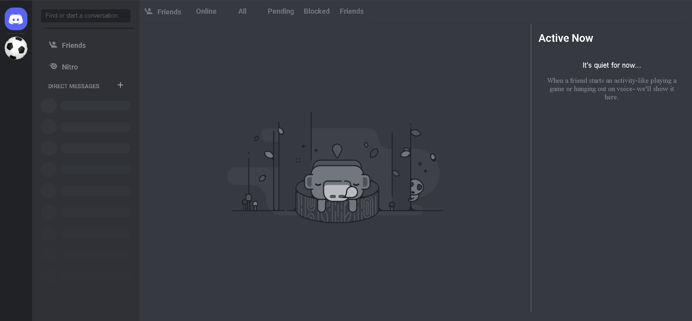

# Discord-UI-Clone
### Made with React.js

The main landing page of the website contains two buttons, clicking on Open In Brwoser/Login button would rout to the login page. The main page is mobile responsive.

The login, register and dashboard pages can only be viewed on a desktop. Just like the original website, these pages can not be viewed on a mobile browser. On a mobile browser, the download and Open in Browser buttons change to Download from PlayStore button.

### No functionality is added as of now

## Link to deployment:
https://sanidhya0504.github.io/discord-clone/
